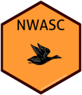

<!-- README.md is generated from README.Rmd. Please edit that file -->

# nwasc segmentation package 

[](https://www.tidyverse.org/lifecycle/#stable)
[](https://travis-ci.org/robgf/nwasc)
[](https://ci.appveyor.com/project/robgf/nwasc)
[](https://codecov.io/gh/robgf/nwasc?branch=master)
[](https://coveralls.io/r/robgf/nwasc?branch=master)

This was a project for BOEM produced while in FWS employment and will be remove in the coming days.

The goal of nwasc is to segment survey data from the [Northwest Atlantic
Seabid Catalog
(NWASC)](https://github.com/USFWS/AMAPPS/tree/master/NWASC).

An example of package usage is contained in the package vignette and on
the github.io webpage <https://robgf.github.io/nwasc/index.html>

## Installation

You can install the released version of nwasc from
[GitHub](https://github.com/robgf/nwasc) with:

``` r
devtools::install_github("robgf/nwasc")
```

For questions or to and issue please consider using the issue feature in
github. For help using this feature or general questions please email
Rob Fowler, <robert_fowler@fws.gov>

Please note that the ‘nwasc’ project is released with a [Contributor
Code of Conduct](.github/CODE_OF_CONDUCT.md). By contributing to this
project, you agree to abide by its terms.
